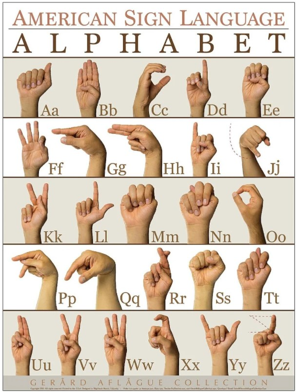

# ICHack-webex-signlanguage

**With this sign language interpreter, we aim to increase accessibility in a hybrid world. Bringing people together, no matter how they communicate.**

## Inspiration
After working from home for the past 2 years, we have all had to adapt to frequent online meetings through video conferencing solutions such as Webex, Zoom and Microsoft Teams. One aspect in particular that we felt could be improved to be more inclusive in this hybrid world was that of helping to enable effective and efficient communication between all participants in group meetings. Our idea of a sign language interpreter came about when thinking of how useful such a feature would be and envisioning a meeting where one didn’t exist. Not all parties of a meeting being able to understand and communicate with one another seemed like an important problem that needed a solution and that we wanted to solve.
 
## What it does
We integrated a sign language translator into Cisco’s Webinar application, Webex, to aid communication in today's hybrid working culture. The application interprets hand gestures in real time to sign language alphabets so that each sentence can be subtitled. It supports English and Chinese sign language translations at the moment, as they are the most commonly used. The language can be chosen by toggling a button right below the meeting screen for convenience. Other than producing captions to the video, we also have a text-to-speech feature, which allows the user to output an audio by pressing on a button. By using these features, the meeting participants can communicate fluently and may even learn more about sign language.

## How we built it
We built our application using a Node.js frontend which is based on the initial example we saw in Cisco’s Webex APIs demonstration. The backend was developed in python using Flask for the server side and the sign language translation was implemented using the mediapipe and numpy libraries in python. 

We used Google’s mediapipe API to interpret hand gestures. The API allowed us to track hand movements by keeping track of 20 different joint locations. We used these joint locations to calculate the vector and angle between each joint to recognise different hand gestures made by the user. This was done by comparing the user inputted hand gesture to the data set we have.

The test data set was collected from sample image data, using a function that we made. We added a functionality that saves the angles for the current gesture when the letter ‘s’ is pressed on the keyboard. This helped significantly when differentiating some gestures with similar shapes. As we could easily collect data from numerous people to train the dataset more accurately.

## Challenges we ran into
Due to similar gestures representing different characters, the result of the hand gesture recogniser may be imprecise. We improved the precision of the recogniser by extending the sample data for training and had all of our group members contribute to the training data, although larger and more diverse training data is necessary for industry-standard precision. Moreover, we added an unique hand gesture that removes a previous character entry in case a wrong character was outputted by a mistake.

Besides, the nature of our application requires quick processing of large amounts of image data without occupying too much storage space. Image processing and gesture recognition can’t be done efficiently on the client side due to computation and storage requirements of these processes, and the specification of web protocol requires the temporary storage of processed user image on server side. To optimise and streamline the process of getting, processing and storing user images, we remove temporary unprocessed images stored in the server as soon as it is processed, and remove processed images as soon as it’s sent to the client.

## Accomplishments that we're proud of
Being able to parse each letter in a sentence with great precision and a relatively high level of accuracy without capturing wrong letters during transitions between gestures. 

Being able to capture all of the letters translated and forming these individual letters into complete words and sentences and being able to display these in the form of subtitles. 

Being able to help with communication with people with disabilities and improve the meeting quality.

## What we learned
We learned about new technologies that some of us hadn’t used before such as Flask to run the python backend server. Node.js and javascript on the frontend and web application side as well as the python libraries mediapipe and numpy we used for detecting the sign language gestures and training the model we were generating. Besides the technical aspects, we also were amazed to find out how many sign languages there are and how difficult it is to distinguish the gestures as many of them look quite similar, even when seen with human eyes. This allowed us to have increased awareness in facilitating communication between all people, especially in the fast-paced world like now. 

## What's next for Sign Language Interpreter for Webex Meetings
Working on improving the accuracy of our detection models by importing and using more data sets which should in turn allow us to expand the set of gestures supported and in more languages. We would like to support more words and sign language phrases to extend beyond the alphabet set we have focused on initially. We would also want to implement a subtitle storage functionality for later review of the meetings. 

**Github link to our project:** [link](https://gitlab.doc.ic.ac.uk/tw1820/ichack-webex-signlanguage)

**Credits:** 
+ Google's mediapipe API: https://github.com/google/mediapipe
+ pyttsx3 API: https://www.thepythoncode.com/article/convert-text-to-speech-in-python
+ Stack Overflow

This project is created by Minseo Lee, Tommy Woodley, Yijun Lin, Jonathan Foo, Shannon Sangha in ICHack22. 